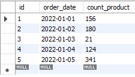
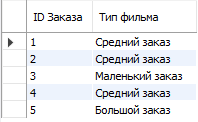
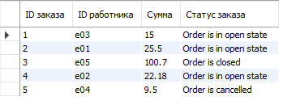

# Используя операторы языка SQL, создайте табличку “sales”. Заполните ее данными
    
    CREATE DATABASE IF NOT EXISTS lesson2; 	
    USE lesson2;

    CREATE TABLE IF NOT EXISTS sales
    (
	    id INT PRIMARY KEY AUTO_INCREMENT,
        order_date DATE NOT NULL,
        count_product INT NOT NULL
    );

    INSERT sales (order_date, count_product)
    VALUES
	    ('2022-01-01', 156),
        ('2022-01-02', 180),
        ('2022-01-03', 21),
        ('2022-01-04', 124),
        ('2022-01-05', 341);

    SELECT *
    FROM sales

# Сгруппируйте значений количества в 3 сегмента — меньше 100, 100-300 и больше 300.

    SELECT
	id AS "ID Заказа",
    IF(count_product < 100, "Маленький заказ", 
		IF(count_product BETWEEN 100 AND 300, "Средний заказ", "Большой заказ"))
	AS "Тип фильма"
    FROM sales;

# Создайте таблицу “orders”, заполните ее значениями. Покажите “полный” статус заказа, используя оператор CASE

    CREATE TABLE IF NOT EXISTS orders
    (
	    id INT PRIMARY KEY AUTO_INCREMENT,
        employee_id VARCHAR(5) NOT NULL,
        amount REAL NOT NULL,
        order_status VARCHAR(10) NOT NULL
    );

    INSERT orders (employee_id, amount, order_status)
    VALUES
	    ('e03', 15.00, 'OPEN'),
        ('e01', 25.50, 'OPEN'),
        ('e05', 100.70, 'CLOSE'),
        ('e02', 22.18, 'OPEN'),
        ('e04', 9.50, 'CANCELLED');
    
    SELECT  id AS "ID заказа", 
	        employee_id AS "ID работника", 
            amount AS "Сумма",
    CASE
	    WHEN order_status = 'OPEN' THEN "Order is in open state"
        WHEN order_status = 'CLOSE' THEN "Order is closed"
        WHEN order_status = 'CANCELLED' THEN "Order is cancelled"
        ELSE "Error 404"
    END AS "Статус заказа"
    FROM orders;
